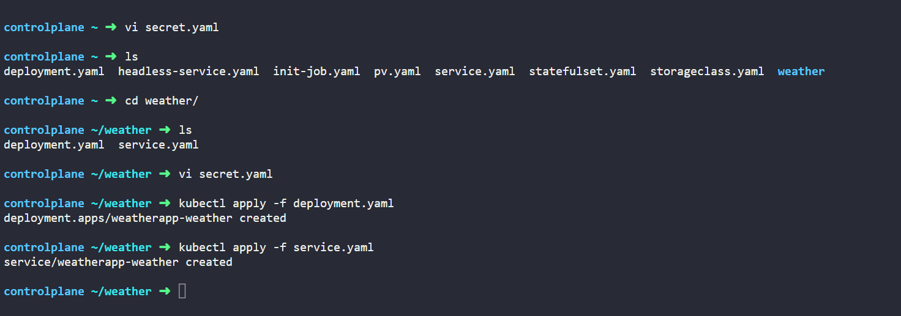
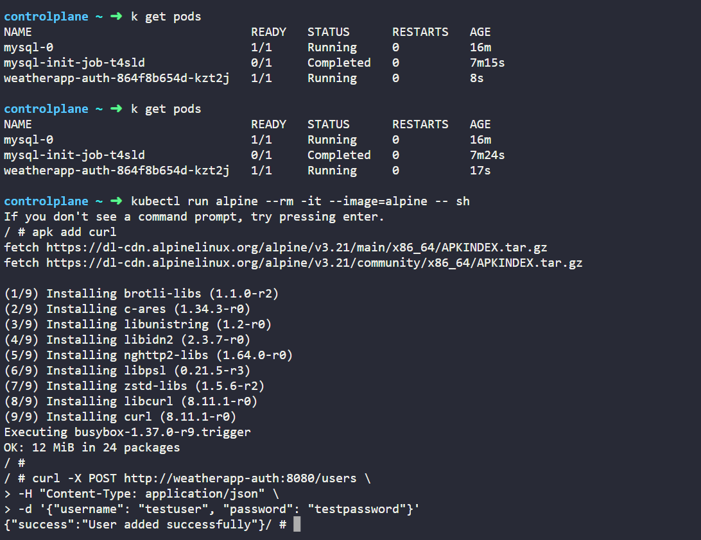


## Setting Up Kubernetes Ingress and Deploying WeatherApp Authentication Service

This guide provides the steps to set up a Kubernetes Ingress and deploy a WeatherApp Authentication service with MySQL as the database. Follow this streamlined process to achieve the setup effectively.

---

## Prerequisites

### Tools Required:
- **Docker**
- **Kubernetes (kubectl CLI)**
- **KinD (Kubernetes in Docker)**

---

## Step 1: Create the KinD Cluster

Delete any existing KinD cluster and create a new one configured for Ingress:

```bash
kind delete cluster
cat <<EOF | kind create cluster --config=-
kind: Cluster
apiVersion: kind.x-k8s.io/v1alpha4
nodes:
- role: control-plane
  kubeadmConfigPatches:
  - |
    kind: InitConfiguration
    nodeRegistration:
      kubeletExtraArgs:
        node-labels: "ingress-ready=true"
  extraPortMappings:
  - containerPort: 80
    hostPort: 80
    protocol: TCP
  - containerPort: 443
    hostPort: 443
    protocol: TCP
EOF
```

---

## Step 2: Install the Ingress Controller

Run the following command to install the Ingress Controller:

```bash
kubectl apply -f https://raw.githubusercontent.com/kubernetes/ingress-nginx/main/deploy/static/provider/kind/deploy.yaml
```

---

## Step 3: Set Up MySQL Database

### Create Kubernetes Manifests
- **Headless Service**: Defines the MySQL service.
- **StatefulSet**: Configures MySQL as a stateful application.
- **Init Job**: Initializes the database.

### Create a Secret for MySQL Credentials
```bash
kubectl create secret generic mysql-secret \
  --from-literal=root-password='secure-root-pw' \
  --from-literal=auth-password='my-secret-pw' \
  --from-literal=secret-key='xco0sr0fh4e52x03g9mv'
```

### Apply the Manifests in Order
```bash
kubectl apply -f headless-service.yaml
kubectl apply -f statefulset.yaml
kubectl apply -f init-job.yaml
```

### Verify Deployment
```bash
kubectl get pods
kubectl get svc
```

**Image Reference**:  


---

## Step 4: Deploy the Authentication Service

### Deployment Manifest
Define the deployment for the authentication service:
```yaml
apiVersion: apps/v1
kind: Deployment
metadata:
  name: weatherapp-auth
spec:
  replicas: 1
  selector:
    matchLabels:
      app.kubernetes.io/name: weatherapp-auth
  template:
    metadata:
      labels:
        app.kubernetes.io/name: weatherapp-auth
    spec:
      containers:
      - name: weatherapp-auth
        image: afakharany/weatherapp-auth:lab
        env:
          - name: DB_HOST
            value: mysql
          - name: DB_USER
            value: authuser
          - name: DB_PASSWORD
            valueFrom:
              secretKeyRef:
                name: mysql-secret
                key: auth-password
          - name: DB_NAME
            value: weatherapp
          - name: DB_PORT
            value: "3306"
          - name: SECRET_KEY
            valueFrom:
              secretKeyRef:
                name: mysql-secret
                key: secret-key
```

### Create the Service
```yaml
apiVersion: v1
kind: Service
metadata:
  name: weatherapp-auth
spec:
  type: ClusterIP
  ports:
    - port: 8080
      targetPort: 8080
      protocol: TCP
  selector:
    app.kubernetes.io/name: weatherapp-auth
```

### Apply Manifests
```bash
kubectl apply -f auth-deployment.yaml
kubectl apply -f auth-service.yaml
```

### Verify Deployment
```bash
kubectl get pods
kubectl get services
```

**Image Reference**:  


---

## Step 5: Test the Authentication Service

### Run a Test Pod
```bash
kubectl run alpine --rm -it --image=alpine -- sh
```

### Test the Service with a Sample POST Request
```bash
apk add curl
curl -X POST http://weatherapp-auth:8080/users \
-H "Content-Type: application/json" \
-d '{"username": "testuser", "password": "testpassword"}'
```

### Expected Response
```json
{"success":"User added successfully"}
```

**Image Reference**:  


---

## Conclusion

This guide provides the essential steps to set up Kubernetes Ingress, deploy MySQL, and the WeatherApp Authentication service. Use the provided images and commands to ensure a seamless setup. For further debugging or enhancements, refer to the Kubernetes documentation.

